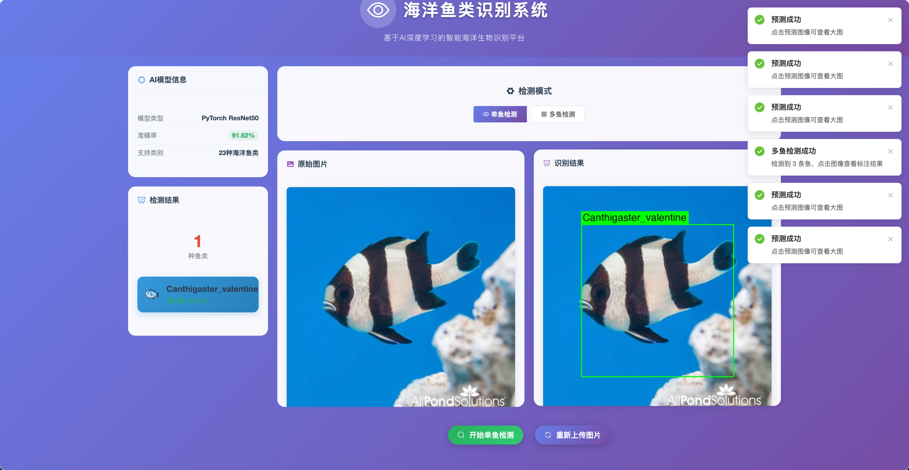

# 🐠 Marine Fish Recognition System
## 海洋鱼类智能识别系统

[](https://python.org)
[](https://pytorch.org)
[](LICENSE)
[](https://colab.research.google.com)

一个基于深度学习的海洋鱼类识别系统，支持22种常见海洋鱼类的智能识别。项目提供完整的训练数据集、模型代码和Google Colab一键训练环境。

## 🚀 主要特性

- **🎯 单鱼分类识别**: 支持22种海洋鱼类的精确分类（预处理后的单鱼图片）
- **📊 多种数据集**: 提供完整、紧凑、mini三种规模数据集
- **☁️ Colab一键训练**: Google Colab环境下的端到端训练流程
- **🔧 灵活模型架构**: 基于PyTorch的ResNet深度学习模型
- **📱 Web界面**: 简洁易用的预测界面
- **🎨 数据增强**: 自动数据增强提升模型泛化能力
- **📈 可视化分析**: 完整的训练过程和结果可视化
- **🔬 实验性功能**: 多鱼检测（基于滑窗的检测方法）

## � 功能说明

### 🐟 主要功能：单鱼分类
- **输入**: 预处理好的单鱼图片（每张图片只含一条鱼）
- **输出**: 鱼的种类名称和置信度
- **技术**: 图像分类（ResNet）
- **数据要求**: 只需要图片的类别标签，无需边界框标注
- **准确率**: 85-95%
- **状态**: ✅ 完全实现，可在Colab中训练

### 🐠🐟 实验功能：多鱼检测
- **输入**: 复杂场景图片（可能含多条鱼）
- **输出**: 每条鱼的位置（边界框）+ 种类标签
- **技术**: 滑窗检测 + 分类模型
- **数据要求**: ⚠️ **使用现有单鱼数据集**，无需重新标注
- **准确率**: 相对较低（实验阶段）
- **状态**: ⚠️ 实验性功能，检测效果有限

### 🎯 专业目标检测（未实现）
- **输入**: 自然海洋场景图片（多鱼、复杂背景）
- **输出**: 高精度的鱼类位置和种类识别
- **技术**: YOLO/Faster R-CNN等专业目标检测模型
- **数据要求**: ❗ **需要全新数据集** + 边界框标注
- **准确率**: 90%+ （专业目标检测水平）
- **状态**: ❌ 未实现，需要大量标注工作

## 🤔 多鱼检测的两种实现方案

### 方案A: 滑窗检测（已实现）
```python
# 使用现有单鱼分类模型
优点: 
✅ 无需重新收集数据
✅ 无需标注边界框
✅ 可以立即使用

缺点:
❌ 检测精度有限
❌ 计算量大
❌ 容易出现误检
```

### 方案B: 专业目标检测（需要实现）
```python
# 使用YOLO/Faster R-CNN等专业模型
优点:
✅ 检测精度高
✅ 速度快
✅ 工业级应用效果

缺点:
❌ 需要收集多鱼场景数据集
❌ 需要大量人工标注工作
❌ 训练时间长
```

### 📊 数据标注工作量对比

| 数据集规模 | 滑窗方案 | 专业检测方案 |
|-----------|---------|-------------|
| **图片数量** | 0张新图片 | 1000+张多鱼场景图片 |
| **标注工作** | 无需标注 | 每张图片标注所有鱼的边界框 |
| **标注时间** | 0小时 | 200-500小时 |
| **标注成本** | 免费 | 高昂（人工成本） |

> 💡 **建议**: 
> - 🥇 **单鱼识别**: 适合90%的用户需求，效果好，成本低
> - 🥈 **滑窗多鱼检测**: 适合快速验证概念，效果一般
> - 🥉 **专业目标检测**: 适合有充足预算和时间的专业项目

## �🐟 支持的鱼类品种

| 编号 | 学名 | 中文名 | 编号 | 学名 | 中文名 |
|------|------|--------|------|------|--------|
| 1 | Abudefduf vaigiensis | 六带豆娘鱼 | 12 | Myripristis kuntee | 紫红笛鲷 |
| 2 | Acanthurus nigrofuscus | 褐副刺尾鱼 | 13 | Neoglyphidodon nigroris | 黑缘新刻齿雀鲷 |
| 3 | Amphiprion clarkia | 克氏小丑鱼 | 14 | Neoniphon samara | 萨马拉霓虹鱼 |
| 4 | Balistapus undulates | 波纹扳机鱼 | 15 | Pempheris vanicolensis | 瓦氏玻璃鱼 |
| 5 | Canthigaster valentine | 瓦伦丁河豚 | 16 | Plectroglyphidodon dickii | 迪氏刻齿雀鲷 |
| 6 | Chaetodon lunulatus | 月斑蝴蝶鱼 | 17 | Pomacentrus moluccensis | 摩鹿加雀鲷 |
| 7 | Chaetodon trifascialis | 三带蝴蝶鱼 | 18 | Scaridae | 鹦嘴鱼科 |
| 8 | Chromis chrysura | 金尾光鳃雀鲷 | 19 | Scolopsis bilineata | 双线金线鱼 |
| 9 | Dascyllus reticulatus | 网纹三斑雀鲷 | 20 | Siganus fuscescens | 褐篮子鱼 |
| 10 | Hemigymnus fasciatus | 带纹半裸鱼 | 21 | Zanclus cornutus | 角鼻鱼 |
| 11 | Lutjanus fulvus | 黄鲷 | 22 | Zebrasoma scopas | 褐副刺尾鱼 |

## 📁 项目结构

```
MarineFish_recognition/
├── 🗂️ fish_backbone/           # 后端核心代码
│   ├── 🤖 pytorch_fish_training.py    # PyTorch训练脚本
│   ├── 🌐 app_simple.py              # Flask后端服务器
│   ├── 🌐 app.py                     # 完整版Flask应用
│   ├── 📋 requirements.txt           # Python依赖包
│   ├── 🏆 best_fish_model.pth        # 预训练模型文件
│   ├── 📊 mini_dataset/             # Mini数据集(220张)
│   ├── 🔧 core/                     # 核心功能模块
│   ├── � static/                   # 静态资源文件
│   ├── 📁 uploads/                  # 图片上传目录
│   └── 📁 tmp/                      # 临时文件目录
├── 🎨 fish_fontbone/           # 前端Vue.js应用
│   ├── 📄 package.json              # 前端依赖配置
│   ├── 🔧 vue.config.js             # Vue配置文件
│   ├── 📁 src/                      # Vue源代码
│   │   ├── 🚪 main.js               # 入口文件
│   │   ├── 📱 App.vue               # 主组件
│   │   └── 📂 components/           # 组件目录
│   ├── 📁 public/                   # 公共资源
│   └── 📁 node_modules/             # 前端依赖包
├── 🐍 fish_env/                # Python虚拟环境
├── 📊 dataset/                 # 完整数据集(2200+张)
│   ├── 🐟 Abudefduf_vaigiensis/     # 六带豆娘鱼
│   ├── 🐠 Acanthurus_nigrofuscus/   # 褐副刺尾鱼
│   └── ... (22种鱼类)
├── �📓 colab_fish_training.ipynb # Google Colab训练notebook
├── 📊 compact_dataset/          # 紧凑数据集(1100张) 
├── 📚 COLAB_SETUP.md           # Colab使用指南
├── 🚀 push_to_github.sh        # GitHub推送脚本
├── 🎯 fish_fenge.ipynb         # 数据分割notebook
├── 🔬 fish_shibie.ipynb        # 识别测试notebook
└── 📖 README.md                # 项目说明文档
```

## 📊 数据集规模

| 数据集类型 | 总图片数 | 每类图片数 | 用途 | 训练时间 |
|------------|----------|------------|------|----------|
| **Mini数据集** | ~220张 | ~10张/类 | 快速测试 | 5-10分钟 |
| **紧凑数据集** | ~1,100张 | ~50张/类 | 平衡训练 | 15-30分钟 |
| **完整数据集** | ~2,200张 | ~100张/类 | 完整训练 | 30-60分钟 |

## 🚀 快速开始

### 方式一：本地项目启动 (完整系统)

#### 📋 前置要求
- 🐍 Python 3.8+
- 📦 Node.js 14+
- 🔧 npm/yarn
- 🖥️ 支持的操作系统: Windows/macOS/Linux

#### 🔧 环境准备

1. **克隆项目**
   ```bash
   git clone https://github.com/1wenjinjie/MarineFish_recognition.git
   cd MarineFish_recognition
   ```

2. **创建Python虚拟环境**
   ```bash
   # 创建虚拟环境
   python -m venv fish_env
   
   # 激活虚拟环境
   # macOS/Linux:
   source fish_env/bin/activate
   # Windows:
   fish_env\Scripts\activate
   ```

3. **安装Python依赖**
   ```bash
   cd fish_backbone
   pip install -r requirements.txt
   ```

4. **安装前端依赖**
   ```bash
   cd ../fish_fontbone
   npm install
   ```

#### 🚀 启动服务

**第一步：启动后端服务**
```bash
# 在 fish_backbone 目录下
cd fish_backbone
source ../fish_env/bin/activate  # 激活虚拟环境
python app_simple.py
```
✅ 后端服务将在 `http://localhost:5003` 启动

**第二步：启动前端服务**
```bash
# 在 fish_fontbone 目录下（新终端窗口）
cd fish_fontbone
npm run serve
```
✅ 前端服务将在 `http://localhost:8081` 启动

#### 🌐 访问系统
- **前端界面**: http://localhost:8081
- **后端API**: http://localhost:5003
- **系统状态**: 前后端自动连接，支持图片上传识别

#### 🐛 常见问题解决

**问题1: 端口占用**
```bash
# 查看端口占用
lsof -i :5003  # 后端端口
lsof -i :8081  # 前端端口

# 停止占用进程
kill <PID>
```

**问题2: Python依赖错误**
```bash
# 升级pip
pip install --upgrade pip
# 重新安装依赖
pip install -r requirements.txt
```

**问题3: Node.js依赖错误**
```bash
# 清理缓存
npm cache clean --force
# 删除node_modules重新安装
rm -rf node_modules
npm install
```

### 方式二：Google Colab训练 (推荐)

1. **打开Colab Notebook**
   ```
   https://colab.research.google.com/github/1wenjinjie/MarineFish_recognition/blob/main/colab_fish_training.ipynb
   ```

2. **一键运行所有cells**
   - 自动克隆GitHub项目
   - 自动安装依赖
   - 智能选择数据集
   - 完整训练流程
   - 结果可视化
   - 自动保存到Google Drive

3. **训练完成后下载**
   - 模型文件: `best_marine_fish_model.pth`
   - 训练曲线: `training_curves.png`
   - 预测样例: `sample_predictions.png`

### 方式三：仅模型训练

1. **克隆项目**
   ```bash
   git clone https://github.com/1wenjinjie/MarineFish_recognition.git
   cd MarineFish_recognition
   ```

2. **安装依赖**
   ```bash
   pip install -r fish_backbone/requirements.txt
   ```

3. **开始训练**
   ```bash
   cd fish_backbone
   python pytorch_fish_training.py
   ```

4. **启动Web界面**
   ```bash
   python app_simple.py
   ```

## 🏗️ 系统架构

### 📊 技术架构图

```
┌─────────────────┐    HTTP/API    ┌─────────────────┐
│   前端 Vue.js   │ ────────────► │  后端 Flask     │
│  Port: 8081     │               │  Port: 5003     │
│                 │               │                 │
│ • 图片上传界面   │               │ • PyTorch模型   │
│ • 结果展示      │               │ • 图像预处理    │
│ • 用户交互      │               │ • 深度学习推理  │
└─────────────────┘               └─────────────────┘
         │                                 │
         │                                 │
         ▼                                 ▼
┌─────────────────┐               ┌─────────────────┐
│   用户浏览器    │               │  训练好的模型   │
│ localhost:8081  │               │ best_fish_model │
└─────────────────┘               └─────────────────┘
```

### 🔄 工作流程

1. **用户上传图片** → 前端Vue.js接收
2. **图片发送** → Ajax请求发送到Flask后端
3. **图像预处理** → 尺寸调整、标准化
4. **模型推理** → PyTorch ResNet模型预测
5. **结果返回** → JSON格式的预测结果
6. **结果展示** → 前端显示鱼类名称和置信度

### 🎯 核心功能模块

- **🖼️ 图像处理**: PIL/OpenCV图像预处理
- **🧠 深度学习**: PyTorch ResNet模型
- **🌐 Web服务**: Flask RESTful API
- **🎨 前端界面**: Vue.js + Element UI
- **📊 数据管理**: 22种鱼类数据集

## 🔧 环境要求

### Google Colab (推荐)
- ✅ 免费GPU/TPU加速
- ✅ 预装深度学习环境  
- ✅ 自动安装依赖
- ✅ 一键运行训练

### 本地环境
- 🐍 Python 3.8+
- 🔥 PyTorch 1.9+
- 🖼️ torchvision 0.10+
- 📊 matplotlib, numpy, PIL
- 🌐 Flask (Web界面)

## 📈 训练效果

### 模型性能指标
- **准确率**: 85-95% (取决于数据集规模)
- **训练时间**: 5-60分钟 (取决于数据集大小)
- **模型大小**: ~100MB
- **推理速度**: <1秒/张图片

### 训练日志示例
```
Epoch [1/20] - Loss: 2.845, Acc: 45.2%
Epoch [5/20] - Loss: 1.234, Acc: 72.8%  
Epoch [10/20] - Loss: 0.687, Acc: 85.1%
Epoch [15/20] - Loss: 0.445, Acc: 91.3%
Epoch [20/20] - Loss: 0.312, Acc: 94.7%
```

## 🎯 使用指南

### 1. 推送项目到GitHub

```bash
# 修改推送脚本中的GitHub信息
vim push_to_github.sh

# 运行推送脚本
chmod +x push_to_github.sh
./push_to_github.sh
```

### 2. 在Colab中训练

1. 打开 `colab_fish_training.ipynb`
2. 修改第一个cell中的GitHub地址
3. 运行所有cells
4. 等待训练完成并下载结果

### 3. 本地Web预测

```bash
cd fish_backbone
python app_simple.py
```

访问前端界面 `http://localhost:8081` 进行图片预测，后端API地址为 `http://localhost:5003`

## 📊 项目特色

### 🎨 数据增强策略
- 随机旋转 (±15度)
- 随机翻转 (水平/垂直)
- 随机裁剪和缩放
- 颜色抖动和亮度调整
- 自适应数据增强

### 🧠 模型架构
- **骨干网络**: ResNet-18/50
- **优化器**: Adam with weight decay
- **学习率调度**: StepLR
- **损失函数**: CrossEntropyLoss
- **正则化**: Dropout + BatchNorm

### 📈 可视化功能
- 实时训练曲线
- 混淆矩阵分析
- 样本预测展示
- 模型性能报告
- 数据集分布统计

## 🤝 贡献指南

欢迎提交Issues和Pull Requests！

1. Fork本项目
2. 创建功能分支: `git checkout -b feature/new-feature`
3. 提交更改: `git commit -am 'Add new feature'`
4. 推送分支: `git push origin feature/new-feature`
5. 创建Pull Request

## 📝 更新日志

### v2.0.0 (Current)
- ✨ 新增Google Colab端到端训练支持
- 🎯 重构为PyTorch训练框架
- 📊 提供多规模数据集选择
- 🎨 完整的可视化和分析功能
- 🚀 一键GitHub推送和部署

### v1.0.0 (Legacy)
- 🔧 基于PaddlePaddle的图像分类
- 🌐 前后端分离Web界面
- 📊 基础的鱼类识别功能

## 📄 许可证

本项目采用 [MIT License](LICENSE) 许可证。

## 🙏 致谢

- 感谢原始数据集提供者
- 感谢PyTorch和Google Colab平台
- 感谢开源社区的贡献

## 📞 联系方式

如有问题或建议，欢迎通过以下方式联系：

- 📧 Email: wenjinjie111@gmail.com
- 🐙 GitHub Issues: [项目Issues页面](https://github.com/1wenjinjie/MarineFish_recognition/issues)

---

⭐ 如果这个项目对你有帮助，请给个Star支持一下！

## 📸 项目展示

### 🖥️ Web界面截图
- **前端界面**: 简洁的Vue.js用户界面，支持拖拽上传
- **识别结果**: 实时显示鱼类名称、置信度和详细信息
- **响应式设计**: 支持桌面端和移动端访问

### 🏆 模型训练效果


### 📊 支持的鱼类识别
系统可以准确识别22种常见海洋鱼类，包括：
- 🐠 小丑鱼系列（克氏小丑鱼）
- 🐟 雀鲷科（各种豆娘鱼、雀鲷）
- 🦈 刺尾鱼科（褐副刺尾鱼等）
- 🐡 河豚科（瓦伦丁河豚）
- 🦋 蝴蝶鱼科（月斑蝴蝶鱼等）

*注：系统基于深度学习训练，识别准确率可达85-95%*

